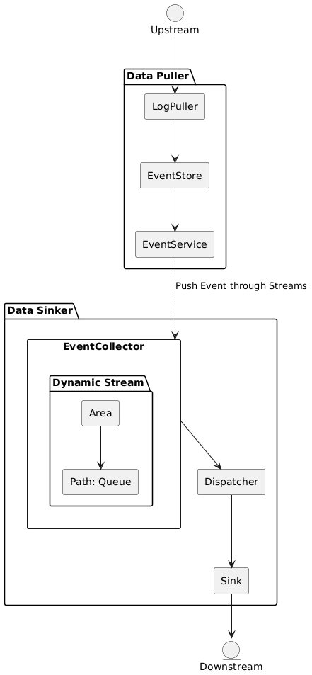

# TiCDC Flow Control Design

- Author(s): [dongmen](https://github.com/asddongmen)
- Tracking Issue(s): [736](https://github.com/pingcap/ticdc/issues/736)

## Background

TiCDC processes data in two main parts:

1. **Data Puller**: Includes LogPuller, EventStore, and EventService, responsible for fetching upstream data.
2. **Data Sinker**: Includes EventCollector, Dispatcher, and Sink, responsible for writing data to downstream systems.

The following diagram illustrates the relationship between the **data puller** and **data sinker**:

<!-- The source file for this diagram: docs/design/medias/flow-control-1.puml -->

In this architecture, **EventService** and **EventCollector** facilitate communication between the two parts:  

- **EventCollector** initiates a subscription and establishes a data stream.  

- The data stream is buffered in **EventCollector**'s memory before being processed by other components.

When downstream consumption lags behind upstream production, data accumulates in memory, potentially causing OOM. To address this, a flow control mechanism is necessary to stop pushing data when congestion occurs.

---

## Design Details

### Pause and Resume Mechanism

The **EventCollector** uses the `dynamicStream` component to handle and buffer data. Each stream corresponds to a `path` (A path represents a dispatcher), and unprocessed data is stored in its unlimited queue, `pendingQueue`.

To manage memory usage, the `dynamicStream` will incorporate a **memory control module**. This module tracks memory usage for each `path` and `area` (An area represents a changefeed) and triggers flow control actions. The detailed plan is as follows:

#### 1. Path-Level Flow Control

- Pause a `path` when its memory usage exceeds **20%** of the total quota.

- Resume the `path` when usage drops below **10%**.

#### 2. Area-Level Flow Control

- Pause an `area` when its memory usage exceeds **80%** of the total quota.

- Resume the `area` when usage drops below **50%**.

#### 3. Circuit Breaker Mechanism

- **Issue**: There is a delay between triggering a pause action and stopping the data stream, which may lead to OOM in extreme cases.

- **Solution**: Set a global threshold. If an `area` exceeds this threshold, discard all events in the longest `path` until memory usage stabilizes.

All flow control actions are initiated by the `dynamicStream`, passed to the **EventCollector**, and executed by the **EventService**.

---

### Stream Rebuilding

The circuit breaker mechanism may cause event loss, resulting in non-sequential data for the **Dispatcher**. When the **Dispatcher** detects non-sequential data, it triggers a stream **reset** to ensure data integrity.

---

### Benefits

This design reduces complexity through:

1. **Unified Logic**: Centralizing memory monitoring and commands in the `dynamicStream` module minimizes inter-module communication.

2. **Layered Control**: Combining `path`-level and `area`-level flow control effectively prevents OOM.

3. **Circuit Breaker**: Protects system stability in extreme scenarios by discarding events only when necessary.
